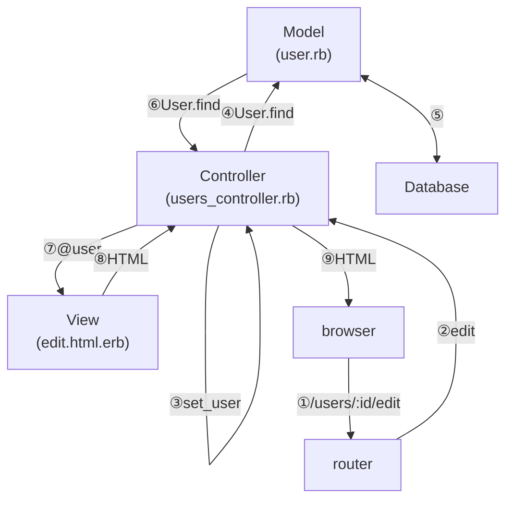

## chapter 2

### 2.2.2

図 2.13を参考にしながら、/users/1/editというURLにアクセスしたときの振る舞いについて図を書いてみてください。

```mermaid
graph TD;

model["Model</br>(user.rb)"];
view["View</br>(edit.html.erb)"];
controller["Controller</br>(users_controller.rb)"];

browser --①/users/:id/edit--> router
router --②edit--> controller
controller --③set_user--> controller
controller --④User.find--> model
model <--⑤--> Database
model --⑥User.find--> controller
controller --⑦@user--> view
view --⑧HTML--> controller
controller --⑨HTML--> browser
```
